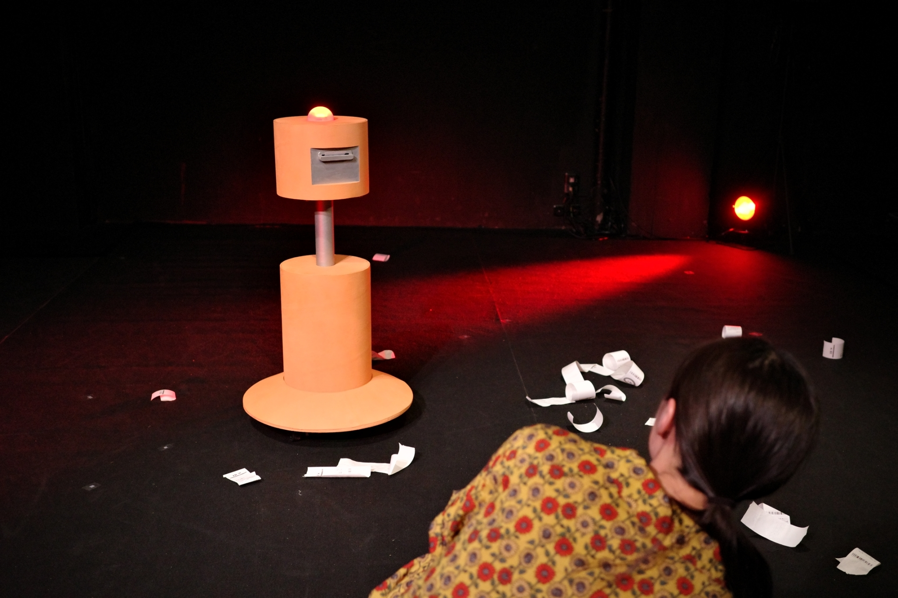

# GR-01
The motor control and thermal printer control system used in the "Show all the back side of the beach house".
  
 

  

## PREPARE
* MacBook Pro
  * TouchDesigner 
  * Max/MSP
* Controller
  * Nintendo Switch Pro Controller
  * JoyKeyMapper.app
* Thermal Printer
  * Symcode 58MM
  * Thermal Roll Paper 20m 58*40mm
* Motor Control
  * STEP 400　Stepper Motor Driver
  * 42mm 2.8V  Phase 400Step Stepper Motor
* LED 
  * M5Stack Basic
  * HEX RGB LED Board
* Battery
  * Sanwa Direct Portable Power Supply AC65W output 11400mAh

## FUNCTION
* Thermal Printer / Motor / LED  Wireless Control

## CONTROL
Control of the LEDs and switching of the text output to the Thermal Printer was done by max, and the Nintendo Switch Pro Controller was used to control the LEDs and the motor. 

## Stage
  
  
 